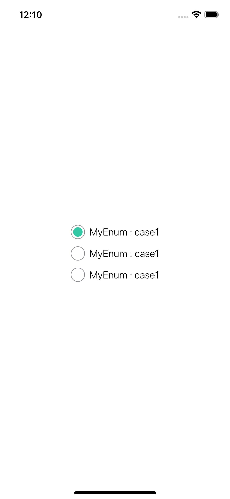

<p align="center">
 </a>
</p>

<h3 align="center">🗳 SwiftUI RadioGroup 🗳</h3>

<div align="center">


</div>

---

<p align="center"> 
    Radio Group Supports Generic Type of Value for SwiftUI
    <br> 
</p>

## 🏁 Getting Started

### Requirements
* Xcode 11+
* SwiftUI
* iOS 14+
* macOS 10.15+

### Installaion
#### Swift Package Manager(SPM)
    File ➜ Swift Packages ➜ Add Package Dependancy..

```Swift
.package(url: "https://github.com/Changemin/RadioGroup", from: "1.1.0")
```

## 🎈Usage
```Swift
@State var value: T = 0

var options: [RadioOption<T>] = [
    RadioOption(label: "Option 1", value: 1),
    RadioOption(label: "Option 2", value: 2),
    RadioOption(label: "Option 3", value: 3)
]

RadioGroup(options: options, value: $value)
```
* `options` : Array of the available options
* `label` : Label displays beyond the button
* `value` : Actually value of the option

> You can change variable type `T` into any type you want. (even custom enum)

## 🛠 Custom Modifiers
```Swift
RadioGroup(options: options, value: $value)
    .accentColor(color: Color)
```
* `color` : accentColor of the button

## Example
#### 👶 Simple
```Swift
import RadioGroup

struct ContentView: View {
    @State var value: Int = 0
    
    var options: [RadioOption<Int>] = [
        RadioOption(label: "Option 1", value: 1),
        RadioOption(label: "Option 2", value: 2),
        RadioOption(label: "Option 3", value: 3)
    ]
    
    var body: some View {
        VStack {
            RadioGroup(options: options, value: $value)
        }
    }
}
```
### Result
<p float="left">
    
</p>

### 🎨 Accent Color, Other value type
```Swift
import RadioGroup

struct ContentView: View {
    @State var value: Float = 0
    
    var options: [RadioOption<Float>] = [
        RadioOption(label: "Option 1(1.1)", value: 1.1),
        RadioOption(label: "Option 2(1.2)", value: 1.2),
        RadioOption(label: "Option 3(1.3)", value: 1.3)
    ]
    
    var body: some View {
        VStack {
            RadioGroup(options: options, value: $value)
                .accentColor(.orange)
        }
    }
}
```
### Result
<p float="left">
    
</p>

### 📚 Advanced, Custom type(enum)
```Swift
import RadioGroup

enum MyEnum {
    case case1
    case case2
    case case3
}

struct ContentView: View {
    @State var value: MyEnum = .case1
    
    var options: [RadioOption<MyEnum>] = [
        RadioOption(label: "MyEnum : case1", value: .case1),
        RadioOption(label: "MyEnum : case1", value: .case2),
        RadioOption(label: "MyEnum : case1", value: .case3)
    ]
    
    var body: some View {
        RadioGroup(options: options, value: $value)
    }
}

```

### Result
<p float="left">
    
</p>

## 📜 License

RadioGroup is available under the MIT license. See the `LICENSE` file for more info.

## ✅ Todos
- [ ] design variation
- [ ] more modifiers
- [ ] custom font

## ✍️ Author

- Byun Kyung Min ➜ [🇰🇷@Changemin](https://github.com/Changemin)
