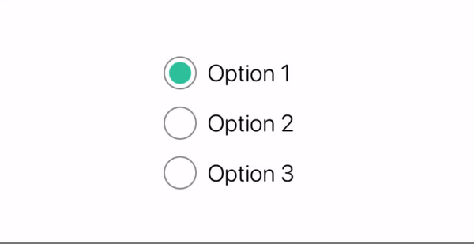
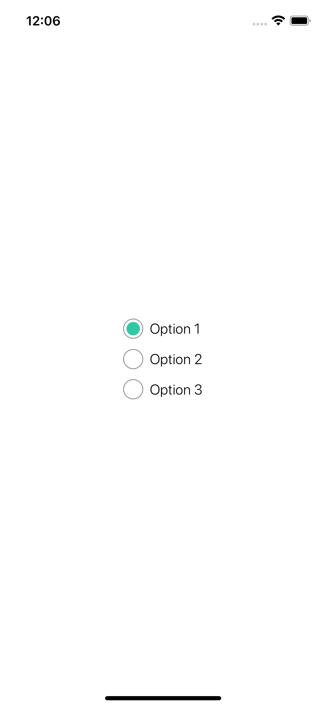

<p align="center">
 </a>
</p>

<h3 align="center">🗳 CMRadioButtonGroup 🗳</h3>

<div align="center">


</div>

---

<p align="center"> 
    Radio Button Group Support Generic Type of Value for SwiftUI
    <br> 
</p>

## 🏁 Getting Started

### Requirements
* Xcode 11+
* SwiftUI
* iOS 14+
* macOS 10.15+

### Installaion
#### Swift Package Manager(SPM)
    File ➜ Swift Packages ➜ Add Package Dependancy..

```Swift
.package(url: "https://github.com/Changemin/CMRadioButtonGroup", from: "1.0.0")
```

<!-- ## 🎈Usage
```Swift
CMBorderBox(edge: Edge.Set, color: Color, width: CGFloat, cornerRadius: CGFloat)
// or
someView.CMBorderBox()
```
* `edge` : where to put the bordr
* `color` : accent color of the border
* `width` : Width of the border
* `cornerRadius` : Corner radius of the box. 

## Example
#### 👶 Simple
```Swift
import CMOneBorderBox

struct ContentView: View {
    var body: some View {
        Text("Hello, World!").CMOneBorderBox()
    }
}
```
### Result
<p float="left">
    
</p>

### 🎨 Accent Color
```Swift
import CMOneBorderBox

struct ContentView: View {
    var body: some View {
        Text("Hello, World!").CMOneBorderBox(color: Color.orange)
    }
}
```
### Result
<p float="left">
    
</p>

### 🧰 Custom Usage
```Swift
import CMOneBorderBox

struct ContentView: View {
    var body: some View {
        Text("Hello, World!").CMOneBorderBox(edge: .top, color: Color.red, width: 5, cornerRadius: 0)
    }
}
```

### Result
<p float="left">
    
</p> -->

## 📜 License

CMRadioButtonGroup is available under the MIT license. See the `LICENSE` file for more info.

## ✍️ Author

- Byun Kyung Min ➜ [🇰🇷@Changemin](https://github.com/Changemin)
